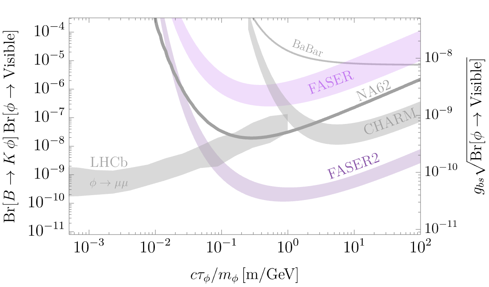

# D and B decay in FASER and CHARM

This repository contains code used to calculate the expected number of events in FASER and CHARM for a scalar particle X created in B or D meson decays. This code was used to derive the bounds in ["Flavor at FASER: discovering light scalars beyond minimal flavor violation" (Balkin, Burger, Feng, Shadmi) - JHEP 04 (2025) 071](https://link.springer.com/article/10.1007/JHEP04(2025)071]):

  

The repository contains three folders: 
- 'lib' : containing the different libraries, further details provided below.
- 'spectra' : containing the B and D mesons production spectra in the LHC and CHARM in the form of a weighted distribution formatted as (theta, p, binWeight), where theta is the angle of the produced meson, p is its momentum in GeV and binWeight is the weight of the bin.
- 'demo' : demonstrating usage of the functions.

## lib/kinemtics.py 
An auxilary file with kinematical functions used by spectrum.py for the calculation of the spectrum of X from B/D decays, and the decay volume factors used by signal.py to calculte the total number of events in FASER/CHARM.
## lib/spectrum.py
Contains functions used to calculate the spectrum of X particles produced from the decay of B or D mesons in LHC or CHARM. The most relevant function is `Xspectrum(mX,decaying_meson,exp,Ntheta,Nphi,eps)`, where
- mX : mass of the X particle in GeV.
- decaying_meson : either 'B' or 'D'. The decay process is assumed to be $B \to K\\, X$ or $D \to \pi\\, X$, respectivley.
- exp : either 'LHC' or 'CHARM'.
- Ntheta,Nphi : number of values in the grid (with $-1<\cos \theta < +1$ and $0<\phi<2\pi$) for the $4\pi$ range of X directions in the rest frame of the decaying meson.
- eps : colinear threshold  $-1+\epsilon<\cos \theta < +1-\epsilon$.  X which are produced colinearly with the decaying particle that are within geometrical acceptance generate an overestimation of the signal due to finite grid size. Neglecting this edge consitutes an underestimation of the signal and is therefore conservative.

  The output of this function is the X spectrum.
  For LHC, it is formatted as a numpy array of shape (N * Ntheta * Nphi, 3) where each row is (log10(theta), log10(p), weight), where N is the number of lines in the B or D spectrum used.
  For CHARM, it is formatted as a numpy array of shape (N * Ntheta * Nphi, 4) where each row is (theta, phi,p, weight), where N is the number of lines in the B or D spectrum used (note that CHARM is off-axis, therefore we are tracking the azimuthal angle).
  **Note**: this array can be saved to file and used to estimate the number of events for different values of X lifetime.
## lib/signal.py
Contains function used to calculate to total number of X decay events expected in the decay volume of FASER or CHARM. This number should be then multiplied by the branching ratio of X to the relevant visible final state in the relevant experiment, e.g. photons and leptons in CHARM. The most relevant function is `get_events(Xspec, mX, tau,decaying_meson,exp)`, where
- Xspec  : spectrum of X particles, formatted as (log10(theta), log10(p), weight). Can be calcuated using `Xspectrum(mX,decaying_meson,exp,Ntheta,Nphi,eps)`.
- mX :  mass of the X particle in GeV.
- tau : lifetime of X in meters.
- decaying_meson : either 'B' or 'D'.
- exp : either 'FASER' or 'CHARM'.
The output of this file is an array (mX,tau,Nevents_FASER,Nevents_FASER2) or (mX,tau,NeventsCHARM) for FASER and CHARM, respectivley. FASER2 differs from FASER by its location and geometry, as well as by the assumed B and D yields due to the increased LHC luminocity.

## Usage
We include a demo file in the form of a jupyter notebook to demonestrate how the code can be used. The file
1) Creates an X spectrum and saves it to file (commented out).
2) Reads a pre-saved X spectrum file.
3) Calculates the signal for an array of tau values.
4) Calulcates the branching ratio bounds, defined as 3/Number of events.
5) Plot the results.

